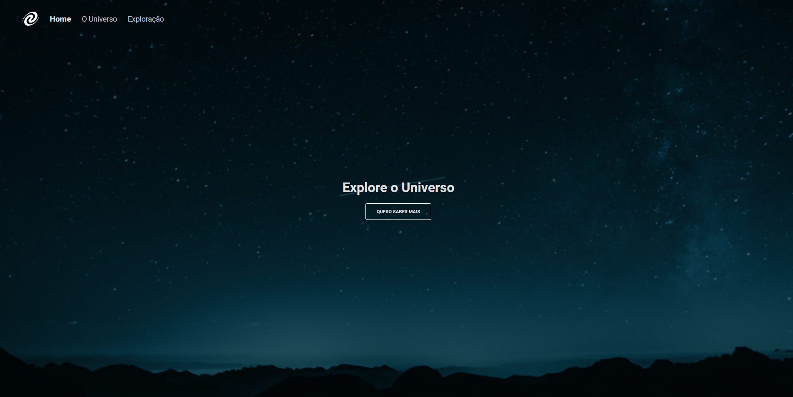

### SPA Universe

  

Projeto realizado dentro do curso Explorer da Rocketseat, no qual criamos um SPA, um projeto que nos leva para um outro nivel do curso, no qual foi nos apresentado os seguintes conceitos:

✔ SPA (Single Page Application);
✔ Mapeamento de rotas; 
✔ Assíncrono e promisses;
✔ Orientação a objetos;
✔ Classes

### Nesse projeto ainda ultilizamos as seguintes tecnologias: 

✔ HTML
✔ CSS
✔ JavaScript
✔ Node.JS
